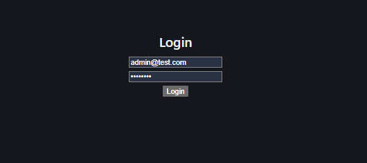
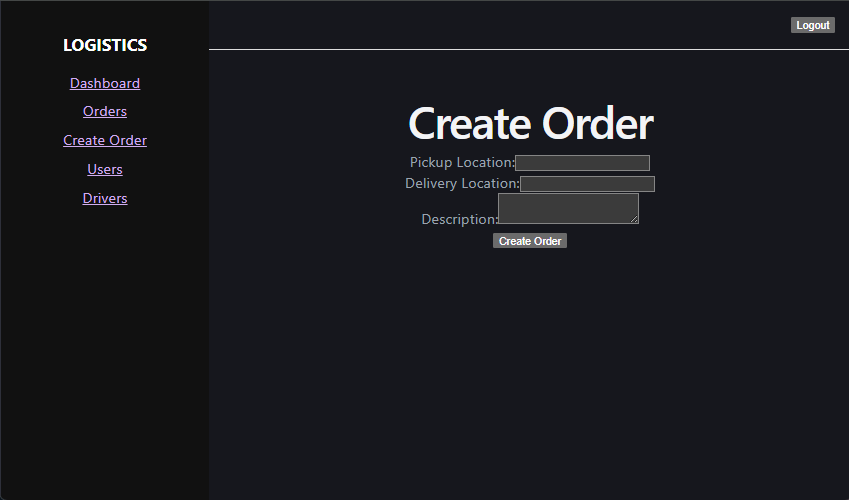
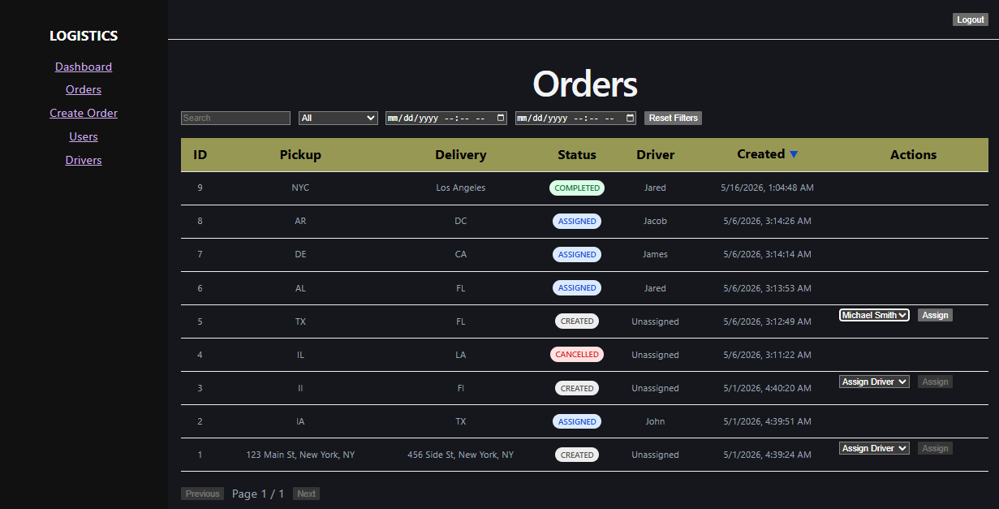
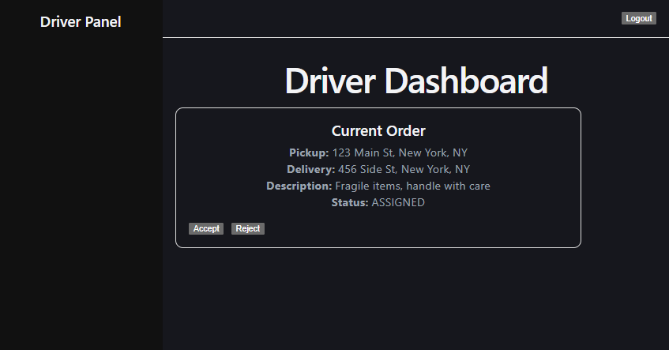
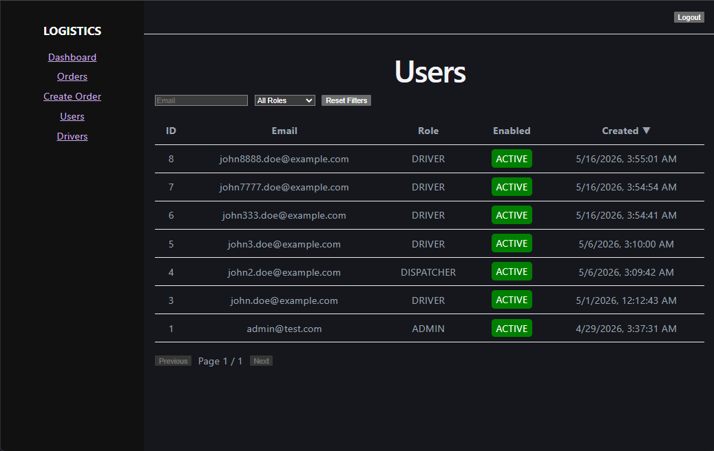
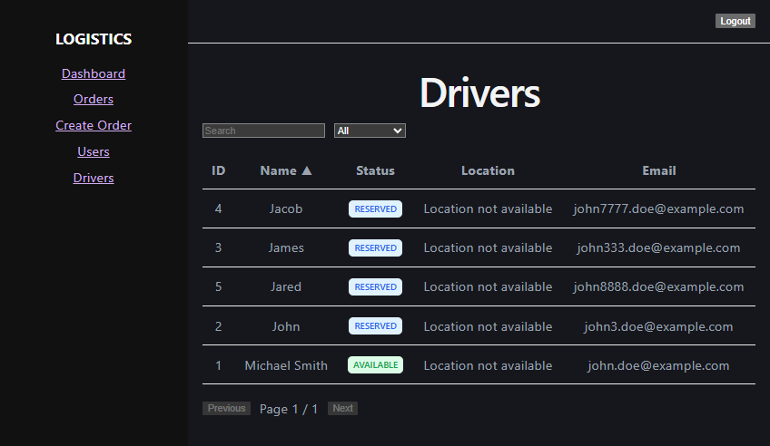
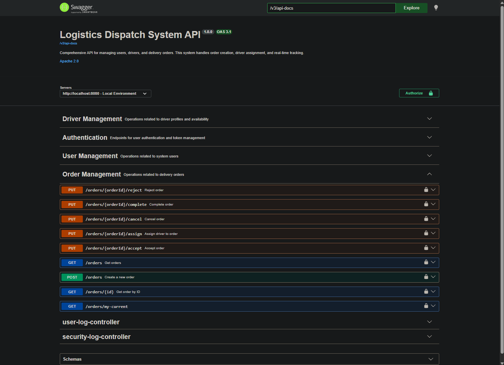
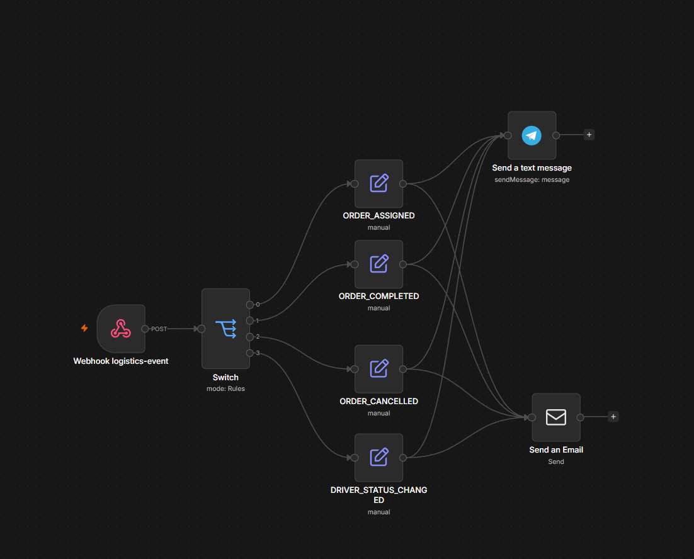
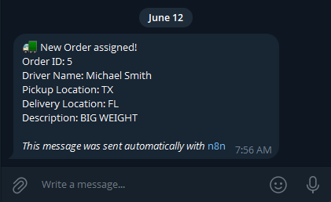

# 🚚 Logistics Dispatch System

> A full-stack logistics management platform built with Spring Boot, React, PostgreSQL, and n8n workflow automation. Designed with clean layered architecture, JWT-based security, role-based access control, and real-time Telegram notifications via webhook-driven automation.

---

## 📋 Table of Contents

- [Overview](#-overview)
- [Features](#-features)
- [Architecture Overview](#-architecture-overview)
- [Tech Stack](#-tech-stack)
- [Project Structure](#-project-structure)
- [Database Overview](#-database-overview)
- [Authentication Flow](#-authentication-flow)
- [Role-Based Access Control](#-role-based-access-control)
- [n8n Workflow Automation](#-n8n-workflow-automation)
- [Audit & Security Logging](#-audit--security-logging)
- [API Overview](#-api-overview)
- [Environment Variables](#-environment-variables)
- [Local Development Setup](#-local-development-setup)
- [Docker Deployment](#-docker-deployment)
- [Example API Requests](#-example-api-requests)
- [Webhook Flow Example](#-webhook-flow-example)
- [Screenshots](#-screenshots)
- [Future Improvements](#-future-improvements)
- [Engineering Highlights](#-engineering-highlights)

---

## 🔍 Overview

The **Logistics Dispatch System** is a backend-heavy full-stack application simulating a real-world delivery dispatch platform. It enables **administrators** and **dispatchers** to manage delivery orders and assign drivers, while **drivers** can accept, reject, or complete their assigned orders through a dedicated dashboard.

The system features a clean, layered Spring Boot backend (Controller → Service → Repository → DTO → Mapper), a React + TypeScript SPA frontend, Flyway-managed database migrations, and an n8n automation workflow that sends Telegram notifications when a driver is assigned to an order.

This project was built to demonstrate practical engineering decisions including pessimistic locking for concurrent order assignments, AOP-based audit logging, refresh token rotation, and Docker-based deployment.

---

## ✨ Features

### 🔐 Authentication & Security
- JWT access token + HTTP-only cookie-based refresh token
- Refresh token rotation on every use (old tokens are revoked)
- Scheduled cleanup of expired refresh tokens (runs nightly at 03:00)
- Custom authentication entry point and access denied handler
- Security event logging (login, logout, refresh, unauthorized, access denied)

### 👥 Role-Based Access Control
- **ADMIN** — Full system access: manage users, drivers, orders, view audit logs
- **DISPATCHER** — Create and manage orders, assign drivers, monitor deliveries
- **DRIVER** — View assigned orders, accept/reject, mark as complete

### 📦 Order Lifecycle Management
- Full order state machine: `CREATED → ASSIGNED → IN_PROGRESS → COMPLETED / CANCELLED`
- Pessimistic locking prevents duplicate driver assignments
- Automatic driver status transitions (AVAILABLE → RESERVED → BUSY → AVAILABLE)
- Optional cancellation reason and completion comments

### 🚗 Driver Management
- Driver profiles linked to user accounts (one-to-one)
- Status tracking: `AVAILABLE`, `BUSY`, `OFFLINE`, `RESERVED`
- Real-time location updates
- Filterable and searchable driver list

### 📊 Audit Logging
- AOP-based `@AuditAction` annotation on controller methods
- Logs: user ID, email, action, entity, IP address, user agent, URI, HTTP method
- Security logs for authentication events
- Both log types accessible via admin-only endpoints with filtering and pagination

### 🤖 Workflow Automation
- n8n-powered workflow automation platform
- Event-driven architecture using Spring Boot webhooks
- Automated processing of logistics events:
    - ORDER_ASSIGNED
    - ORDER_COMPLETED
    - ORDER_CANCELLED
    - DRIVER_STATUS_CHANGED
- Telegram and Email notification delivery
- Asynchronous, non-blocking integration between application services and automation workflows

### 🛠 Infrastructure
- Docker Compose orchestrating backend, frontend, PostgreSQL, and n8n
- Flyway database migrations (8 versioned migration scripts)
- Async thread pool for background tasks (`@EnableAsync`)
- OpenAPI / Swagger UI documentation at `/swagger-ui`

---

## 🏗 Architecture Overview

```
┌─────────────────────────────────────────────────────┐
│                   React Frontend                    │
│   (Vite + TypeScript + Axios + React Router v7)     │
│                                                     │
│  Pages: Login · Dashboard · Orders · Drivers · Users│
│  Guards: AuthGuard · RoleGuard                      │
│  Token: In-memory access token + HttpOnly cookie    │
└───────────────────┬─────────────────────────────────┘
                    │ HTTP / REST
┌───────────────────▼─────────────────────────────────┐
│              Spring Boot Backend                    │
│                                                     │
│  ┌──────────┐  ┌──────────┐  ┌──────────────────┐   │
│  │Controllers│→│ Services │→ │  Repositories    │   │
│  └──────────┘  └──────────┘  └──────────────────┘   │
│         │           │                │              │
│  ┌──────▼───┐  ┌────▼─────┐  ┌─────▼────────────┐   │
│  │   DTOs   │  │ Mappers  │  │  Specifications  │   │
│  └──────────┘  └──────────┘  └──────────────────┘   │
│                                                     │
│  ┌──────────┐  ┌──────────┐  ┌──────────────────┐   │
│  │  JWT     │  │  AOP     │  │  Flyway          │   │
│  │  Auth    │  │  Audit   │  │  Migrations      │   │
│  └──────────┘  └──────────┘  └──────────────────┘   │
└───────────────────┬─────────────────────────────────┘
                    │ JDBC
┌───────────────────▼─────────────────────────────────┐
│                 PostgreSQL                          │
│   users · drivers · orders · refresh_tokens         │
│   user_logs · security_logs                         │
└───────────────────┬─────────────────────────────────┘
                    │
┌───────────────────▼─────────────────────────────────┐
│               n8n Automation                        │                      
│   Action: Send Telegram\Email messages              │
└─────────────────────────────────────────────────────┘
```

---

## 🛠 Tech Stack

| Layer | Technology |
|---|---|
| Backend | Spring Boot 4.x, Java 26 |
| Security | Spring Security, JWT (jjwt 0.13), BCrypt |
| Persistence | Spring Data JPA, Hibernate, PostgreSQL |
| Migrations | Flyway |
| Mapping | MapStruct 1.5.5 |
| API Docs | SpringDoc OpenAPI 3 / Swagger UI |
| Frontend | React 19, TypeScript 6, Vite 8 |
| HTTP Client | Axios 1.16 |
| Routing | React Router v7 |
| Automation | n8n (self-hosted) |
| Notifications | Telegram Bot API (via n8n) |
| Build | Gradle 9.5 |
| Containerization | Docker, Docker Compose |
| Database | PostgreSQL 15 |

---

## 📁 Project Structure

```text
backend/
 ├── common/        # audit, exceptions, utilities
 ├── security/      # JWT auth, refresh tokens, RBAC
 ├── order/         # order lifecycle management
 ├── driver/        # driver management
 ├── user/          # user management
 └── n8n/           # webhook integration

frontend/
 ├── pages/
 ├── components/
 ├── api/
 └── auth/

n8n/workflows/
docker-compose.yml
```

---

## 🗄 Database Overview

Database schema is managed through Flyway versioned migrations.
Core entities:

- users
- drivers
- orders
- refresh_tokens
- user_logs
- security_logs


### Entity Relationships
```
users (1) ─────── (0..1) drivers
users (1) ─────── (many) orders [created_by]
users (1) ─────── (many) refresh_tokens
drivers (1) ────── (many) orders [driver_id]
```

### Key Design Decisions

- **PostgreSQL native ENUMs** (`user_role`, `driver_status`, `order_status`) used for type safety at the DB level
- **Pessimistic write locks** (`SELECT ... FOR UPDATE`) on `Order` and `Driver` rows during assignment to prevent race conditions
- **Cascade delete** on `refresh_tokens` when a user is deleted
- **`@Generated` timestamps** — `created_at` columns are DB-default managed, not application-managed

---

## 🔐 Authentication Flow

```
1. POST /auth/login
   ├── Validates email + BCrypt password
   ├── Issues JWT access token (short-lived, configurable)
   ├── Creates RefreshToken entity in DB
   └── Sets refresh token as HttpOnly cookie (path: /auth)

2. Authenticated Requests
   ├── Client sends: Authorization: Bearer <access_token>
   └── JwtAuthFilter validates token → sets SecurityContext

3. POST /auth/refresh
   ├── Reads refresh token from HttpOnly cookie
   ├── Validates token: exists, not revoked, not expired
   ├── Rotates token: marks old as revoked, creates new
   └── Returns new access token + sets new cookie

4. POST /auth/logout
   ├── Authenticates current user
   ├── Revokes ALL refresh tokens for that user
   └── Clears the cookie

```

---

## 🎭 Role-Based Access Control

| Endpoint Group | ADMIN | DISPATCHER | DRIVER |
|---|:---:|:---:|:---:|
| `POST /users` | ✅ | ❌ | ❌ |
| `GET /users` | ✅ | ❌ | ❌ |
| `GET /users/me` | ✅ | ✅ | ✅ |
| `PUT /users/me/password` | ✅ | ✅ | ✅ |
| `POST /drivers` | ✅ | ❌ | ❌ |
| `GET /drivers` | ✅ | ✅ | ❌ |
| `PUT /drivers/{id}/status` | ✅ | ❌ | ❌ |
| `POST /orders` | ✅ | ✅ | ❌ |
| `GET /orders` | ✅ | ✅ | ❌ |
| `PUT /orders/{id}/assign` | ✅ | ✅ | ❌ |
| `PUT /orders/{id}/cancel` | ✅ | ✅ | ❌ |
| `PUT /orders/{id}/accept` | ❌ | ❌ | ✅ |
| `PUT /orders/{id}/reject` | ❌ | ❌ | ✅ |
| `PUT /orders/{id}/complete` | ❌ | ❌ | ✅ |
| `GET /orders/my-current` | ❌ | ❌ | ✅ |
| `GET /audit/**` | ✅ | ❌ | ❌ |

Access control is enforced at two levels:
1. **`@PreAuthorize`** annotations on controllers/methods
2. **`SecurityConfig`** HttpSecurity rules for path-level protection

---

## 🤖 n8n Workflow Automation

When a dispatcher assigns a driver to an order, the backend fires an **async webhook** to n8n, which then sends a **Telegram notification**.

### Trigger Point

```java
// OrderController.java
@PutMapping("/{orderId}/assign")
public OrderResponseDto assignDriver(...) {
    OrderResponseDto order = orderService.assignDriver(orderId, dto);
    webhookService.sendOrderAssignedEvent(order);  // async, non-blocking
    return order;
}
```

### WebhookService

```java
@Async
public void sendOrderAssignedEvent(OrderResponseDto order) {
    restTemplate.postForEntity(webhookProperties.getOrderAssignedUrl(), order, String.class);
}
```

The `@Async` annotation ensures the webhook call runs on a separate thread pool (`async-log-` prefix, core pool: 5, max: 10). Failures are caught and logged — they do not affect the HTTP response.

### n8n Workflow (`order-assigned.json`)

```
[Webhook Trigger: POST /order-assigned]
            │
            ▼
[Telegram: Send Message]
  "New order assigned!
   Order ID: {{ $json.body.id }}
   Driver: {{ $json.body.driverName }}
   Pickup: {{ $json.body.pickupLocation }}
   Delivery: {{ $json.body.deliveryLocation }}"
```

### Configuration

| Variable | Description |
|---|---|
| `WEBHOOK_ORDER_ASSIGNED_URL` | Full n8n webhook URL, e.g. `http://n8n:5678/webhook/order-assigned` |

---

## 📋 Audit & Security Logging
 
### Business Action Audit (`@AuditAction`)

Applied via AOP to controller methods. Captures before/after execution:

```java
@AuditAction(UserAction.ASSIGN_DRIVER)
@PutMapping("/{orderId}/assign")
public OrderResponseDto assignDriver(...) { ... }
```

**Captured fields:** `userId`, `email`, `action`, `entity (class name)`, `entityId`, `ip`, `userAgent`, `requestUri`, `httpMethod`, `details (SUCCESS or error message)`

**Available actions:** `CREATE_ORDER`, `UPDATE_ORDER`, `CANCEL_ORDER`, `ASSIGN_DRIVER`, `CREATE_USER`, `UPDATE_USER_PASSWORD`, `CREATE_DRIVER`, `UPDATE_DRIVER_STATUS`, `UPDATE_DRIVER_LOCATION`, and more.

### Security Event Logging

Separate log table tracks authentication events:

```
LOGIN         — success/failure with reason (USER_NOT_FOUND, INVALID_PASSWORD)
LOGOUT        — success/failure
REFRESH_TOKEN — success/failure
UNAUTHORIZED  — 401 from authentication entry point
ACCESS_DENIED — 403 from access denied handler
```

Both log types are queryable via paginated, filterable admin endpoints:
- `GET /audit/user-logs`
- `GET /audit/security-logs`

---

## 🌐 API Overview

**Full API documentation available in Swagger UI:** `http://localhost:8080/swagger-ui/index.html`

---

## ⚙️ Environment Variables

### Backend (`.env` or `application-local.properties`)

```env
# Database
DB_URL=jdbc:postgresql://localhost:5433/logistics
DB_DRIVER=org.postgresql.Driver
DB_USERNAME=postgres
DB_PASSWORD=postgres

# JWT
JWT_SECRET_KEY=your-256-bit-secret-key-here-minimum-32-chars
JWT_ACCESS_EXPIRATION_TIME=15m
JWT_REFRESH_EXPIRATION_TIME=7d

# n8n Webhook
WEBHOOK_ORDER_ASSIGNED_URL=http://localhost:5678/webhook/order-assigned
```

### Docker Compose (passed via environment section)

```env
SPRING_PROFILES_ACTIVE=prod
DB_URL=jdbc:postgresql://postgres:5432/logistics
DB_DRIVER=org.postgresql.Driver
DB_USERNAME=postgres
DB_PASSWORD=postgres
JWT_SECRET_KEY=your-secret-key
JWT_ACCESS_EXPIRATION_TIME=15m
JWT_REFRESH_EXPIRATION_TIME=7d
WEBHOOK_ORDER_ASSIGNED_URL=http://n8n:5678/webhook/order-assigned
```

---

## 💻 Local Development Setup

### Prerequisites

- Java 21+ (or 26 as configured in `build.gradle`)
- Node.js 20+
- PostgreSQL 15
- Gradle 9.5+

### 1. Clone the repository

```bash
git clone https://github.com/AveEg0/logistics-dispatch-system.git
cd logistics-dispatch-system
```

### 2. Set up PostgreSQL

```sql
CREATE DATABASE logistics;
```

### 3. Configure backend properties

Create `src/main/resources/application-local.properties`:

```properties
spring.datasource.url=jdbc:postgresql://localhost:5432/logistics
spring.datasource.username=postgres
spring.datasource.password=postgres
spring.datasource.driver-class-name=org.postgresql.Driver

jwt.secret-key=your-minimum-32-character-secret-key-here
jwt.access-expiration-time=15m
jwt.refresh-expiration-time=7d

app.webhooks.order-assigned-url=http://localhost:5678/webhook/order-assigned
```

Update `application.properties` to activate the local profile:

```properties
spring.profiles.active=local
```

### 4. Run the backend

```bash
./gradlew bootRun
```

Flyway will automatically run all migrations on startup. The API will be available at `http://localhost:8080`.

### 5. Run the frontend

```bash
cd frontend
npm install
npm run dev
```

The frontend will be available at `http://localhost:5173`.

### 6. Access Swagger UI

```
http://localhost:8080/swagger-ui/index.html
```

---

## 🐳 Docker Deployment

### Full Stack with Docker Compose

The `docker-compose.yml` orchestrates four services:

| Service | Port | Description |
|---|---|---|
| `postgres` | `5433:5432` | PostgreSQL 15 database |
| `backend` | `8080:8080` | Spring Boot API |
| `frontend` | `3000:3000` | React SPA |
| `n8n` | `5678:5678` | Workflow automation |

### Build and Start

```bash
# Build the Spring Boot JAR first
./gradlew clean build -x test

# Start all services
docker compose up --build -d
```

### View Logs

```bash
# All services
docker compose logs -f

# Backend only
docker compose logs -f backend

# n8n only
docker compose logs -f n8n
```

### Stop Services

```bash
docker compose down

# Remove volumes too
docker compose down -v
```

### Configure n8n Workflow

1. Open n8n at `http://localhost:5678`
2. Import the workflows from `n8n/workflows`
3. Add your Telegram Bot API credentials
4. Set the `chatId` to your desired Telegram chat
5. Activate the workflows

---

## 📡 Example API Requests

### Login

```bash
curl -X POST http://localhost:8080/auth/login \
  -H "Content-Type: application/json" \
  -c cookies.txt \
  -d '{
    "email": "admin@example.com",
    "password": "SecurePass123!"
  }'
```

```json
{
  "accessToken": "eyJhbGciOiJIUzI1NiJ9..."
}
```


### Assign a Driver

```bash
curl -X PUT http://localhost:8080/orders/1/assign \
  -H "Content-Type: application/json" \
  -H "Authorization: Bearer <access_token>" \
  -d '{"driverId": 3}'
```

---

## 🔔 Webhook Flow Example

**Scenario:** Dispatcher assigns driver #3 to order #42

```
1. Frontend → PUT /orders/42/assign { driverId: 3 }

2. OrderService.assignDriver()
   ├── Acquires pessimistic lock on Order #42
   ├── Acquires pessimistic lock on Driver #3
   ├── Validates: order status = CREATED, driver status = AVAILABLE
   ├── Sets order.status = ASSIGNED, order.driver = Driver#3
   ├── Sets driver.status = RESERVED
   └── Saves both entities

3. WebhookService.sendOrderAssignedEvent(order) [ASYNC]
   └── POST http://n8n:5678/webhook/order-assigned
       Body: { id: 42, driverName: "Michael Smith",
               pickupLocation: "...", deliveryLocation: "..." }

4. n8n Workflow
   └── Telegram Bot: "New order assigned!
                       Order ID: 42
                       Driver: Michael Smith
                       Pickup: 123 Main St..."

5. HTTP Response returned to frontend (does not wait for webhook)
```

---

## 📸 Screenshots

| View                      | Screenshot                                   |
|---------------------------|----------------------------------------------|
| Login Page                |             |
| Create Order              |        |
| Orders Table with Assign  |                |
| Driver Dashboard          |      |
| Users Management          |                |
| Drivers List              |               |
| Swagger UI                |                   |
| n8n Workflow              |           |
| Telegram Notification     |  |

---

## 🔮 Future Improvements

- WebSocket/SSE updates
- Integration tests with Testcontainers
- Metrics & observability
- Kafka-based event processing
- Map integration
---

## 🏆 Engineering Highlights

- Pessimistic locking for concurrent order assignment
- Refresh token rotation with revocation
- AOP-based audit logging
- Async webhook dispatch via n8n
- In-memory JWT access token storage
- JPA Specifications for dynamic filtering
- PostgreSQL native ENUM usage
- Flyway-managed schema migrations
---

## 👤 Author

**Oleksandr Karmazyn**
- GitHub: [@AveEg0](https://github.com/AveEg0)

---

## 📄 License

This project is licensed under the **Apache License 2.0** — see the [LICENSE](LICENSE) file for details.

---